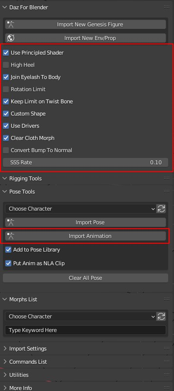
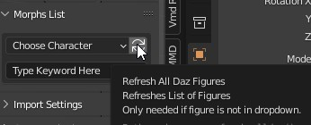
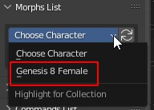
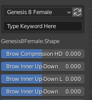

# Daz For Blender Bridge

**This was a fork from Official Daz to Blender Bridge. Now it merged everything from DTB 2022, with some really good updates official DTB 2022 doesn't have. It comes with 14 new features and 3 bug fixing.**  

#### Version
addon: 2.27.0   
blender: >= 3.1

## Key feature
### Daz Script
* **Handle high heel.** (If you use this script, you don't need to check "High Heel" in Blender's addon when importing a character.)  

### Blender Addon
* **It converts Daz Shader to Blender's default Principled Shader** . So, you can export Daz model from Blender with all textures correctly. Then, you can use Blender as a Daz Bridge for all 3D tools.    
* Changed addon name to "Daz For Blender"(**DFB**), **so you can use it with Official DTB 2022 together**.
* **Import animation**
* **Handle tiled material**
* It fixed an important bug so **you can import pose file correctly**.
* Import a pose file by picking its tip image.
* **Handle High Heel**. I believe every Daz user need this.
* Merge eyelashes into body mesh, so you can export morphs from blender to other 3D tools.
* Convert Bump to Normal Map when importing, so you can export your character to game engine.
* **Everything official DTB 2022 has, is merged into this one**.

### AO Map
For game engine, AO map is still important. So, I baked it for you with python script, you can get it from "AO" folder of this project.   

This AO can be used on all Genesis 8 characters, no matter how they look.  

#### New options for importing:  
  - Use Principled shader: Uncheck to use iray shader
  - **High Heel: check to ignore feet rotation for high heel, also works when importing pose.**
  - Rotation Limit: Uncheck to turn off(mute) rotation limit after importing. 
  - **Keep Limit on Twist Bone:** check to keep twist bone's rotation limit, but turn off other bones' limit
  - Custom Shape: Check to use custom shapes for bones
  - Use Drivers: Check to use drivers for morphs(shape keys on mesh).
  - **Clear Morph on Clothes**: it clears morphs on all wearable objects. So you won't have facial morphs on clothes.
  - **Convert Bump to Normal**: It is slow, but you only need to do it once if bump map is not changed. 
  - Reuse Normal: reuse normal map files, so you do not have to re-converted it.
  - **SSS Rate:** Rate between Principled Subsurface and Daz's Translucency Weight

## Notice
### You Need to Refresh Daz Model List after re-open your scene
When you want to apply pose, animation or use shape key drivers. This addon need to know which Daz model you want to apply with.  

**It is not based on which armature you select. It is based on which Daz model you choose on this addon's panel. There is a Daz model list on the panel.**  

When you re-open your scene, you need to click the refresh button on addon panel, it will scan all Daz model in the scene.  
  

Now you have a list of Daz models in this scene.  
  

Choose the one you want to use. Then shape key drivers will show up, also you can apply pose or animation to it now.  
  

This is how this official bridge works, I just leave it that way.  

### Hierarchical Pose Presets
This addon can not import **Hierarchical Pose Presets**.  

What is **Hierarchical Pose Presets**? They look like a normal pose preset, but in totally different format. They are used to save multiple item's pose together in one file. For example, a pose for playing mobile phone. It gonna set both the character and the mobile phone's pose with one preset file.   

**This can not be imported, but you can re-save it into a normal pose preset file in Daz, then import the re-saved one.**  

### EyeClosed shape key
Be noticed, EyeClosed shape key is not a real shape key, it is a driver of EyeClosedL and EyeClosedR. If you don't use drivers, EyeClosed shape key won't work, you need to set EyeClosedL and EyeClosedR directly.  

### Subsurface
Blender will add a blur to subsurface material, which will make you can not see your model clearly.  
So it is converted in this way:  
`Blender's Subsurface = Translucency Weight * SSS_Rate` (SSS_Rate's default value is 0.5)  
Then you can see your model more clearly. You can alwasy change SSS Rate on the Panel as you wish  

### Convert Bump Map to Normal Map
This process is purely done in blender without installing any third party package. So it is slow.  

But, you can reuse it if bump file is not changed, so you only need to do it once.  

This converted normal map file will be save to:`/bump_file_path/bump_file_name_normal.ext`, ext will be same as bump file.  

---
* Owner: [Daz 3D][OwnerURL] – [@Daz3d][TwitterURL]
* License: [Apache License, Version 2.0][LicenseURL] - see ``LICENSE`` and ``NOTICE`` for more information.
* Offical Release: [Daz to Blender Bridge][ProductURL]
* Official Project: [github.com/daz3d/DazToBlender][RepositoryURL]

## Maunal Installation
### Blender Addon
* Download this whole project as zip, then unzip it.
* Go to Blender addon subfolder, find "**DFB**" Folder, zip this folder into a zip file.
* Install this zip file as a blender addon.

### Daz Script
You can use Daz's official DTB 2022 at Daz side, with this blender addon at Blender side. So no need to install this daz script into Daz.  

But, if you still want to use this at Daz side. Do following steps:  
* Download this whole project as zip, the unzip it.
* Go to Daz subfolder, copy these daz script files into script folder of your Daz's content library. You better create a folder for them. For example, "DFB".
* In Daz, select your model then run "Daz to Blender.dsa" script. 
* You can add it as a custom action to Daz's menu.

